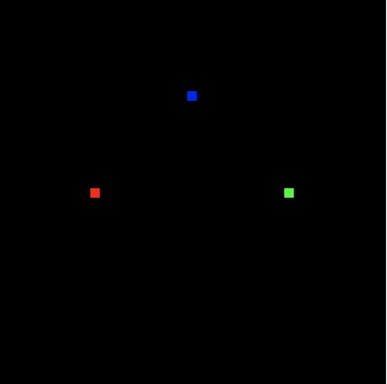
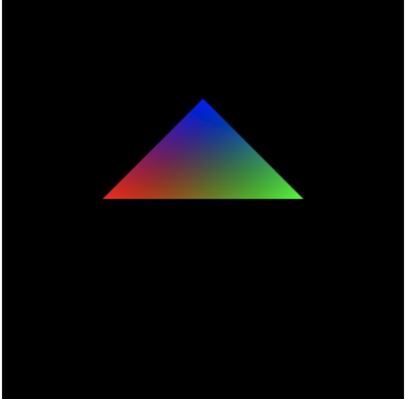

# 绘制三角形

## 画单个点
上一章画单个点的流程：获取canvas元素 -> 获取WebGL绘图上下文 -> 初始化着色器 -> 设置canvas背景色 -> 清除之前的绘图内容 -> 绘图。


我们回顾下这个流程：
```javascript
// 第一步：获取webgl上下文
let canvas = document.querySelector('#webgl');
let gl = canvas.getContext('webgl');

// 第二步：编写着色器代码
// 顶点着色器
const VSHADER = /* glsl */`
	attribute vec4 a_Position;
	void main() {
		gl_Position = a_Position;
		gl_PointSize = 10.0;
	}
`;
// 片元着色器
const FSHADER = /* glsl */`
	void main() {
		gl_FragColor = vec4(1.0, 0.0, 0.0, 1.0);
	}
`;

// 第三步：创建着色器
const vShader = gl.createShader(gl.VERTEX_SHADER);
const fShader = gl.createShader(gl.FRAGMENT_SHADER);

// 第四步：初始化着色器
gl.shaderSource(vShader, VSHADER);
gl.shaderSource(fShader, FSHADER);

// 第五步：编译着色器
gl.compileShader(vShader);
gl.compileShader(fShader);

// 第六步：创建程序
let program = gl.createProgram();

// 第七步：绑定着色器到程序
gl.attachShader(program, vShader);
gl.attachShader(program, fShader);

// 第八步：连接程序到上下文
gl.linkProgram(program);

// 第九步：启用程序
gl.useProgram(program);

// 第十步：向着色器传值
let a_Position = gl.getAttribLocation(program, 'a_Position');
gl.vertexAttrib3f(a_Position, 0.0, 0.5, 0.0);

// 第十一步：绘图
gl.clearColor(0.0, 0.0, 0.0, 1.0);
gl.clear(gl.COLOR_BUFFER_BIT);
gl.drawArrays(gl.POINTS, 0, 1);
```

## 画多个点
画多个点多了一个步骤：  
获取canvas元素 -> 获取WebGL绘图上下文 -> 初始化着色器 -> **设置点的坐标信息** -> 设置canvas背景色 -> 清除之前的绘图内容 -> 绘图。  

**设置点的坐标信息**的详细流程：
创建缓冲区 -> 将缓冲区绑定到目标 -> 向缓冲区写入数据 -> 将缓冲区对象分配给attribute变量 -> 启动缓冲区对象与attribute变量的连接。

```javascript
// gl.vertexAttrib3f(a_Position, 0.0, 0.5, 0.0); //将上一章中的只画一个点的操作注释

// 准备好点数据
let vetices = new Float32Array([
	-0.5, 0, 0.5, 0, 0, 0.5
]);

// 创建缓冲区
const vertexBuffer = gl.createBuffer();
// 绑定缓冲区
gl.bindBuffer(gl.ARRAY_BUFFER, vertexBuffer);
// 向缓冲区传准备好的数据
gl.bufferData(gl.ARRAY_BUFFER, vetices, gl.STATIC_DRAW);
// 参数意义
gl.vertexAttribPointer(a_Position, 2, gl.FLOAT, false, 0, 0);
gl.enableVertexAttribArray(a_Position);

gl.clearColor(0.0, 0.0, 0.0, 1.0);
gl.clear(gl.COLOR_BUFFER_BIT);
gl.drawArrays(gl.POINTS, 0, 3); // 将1改成3，表示要画三个点。
```
大家能想象出我画的三个点的位置吗？

## api
刚才我们使用了几个webgl的api来画点，简单介绍下这些api的使用及参数。

### gl.bindBuffer()
```
gl.bindBuffer(target, buffer)
target参数值可以为：
gl.ARRAY_BUFFER 表示缓冲区对象中包含了顶点的数据，目前我们主要使用这个
gl.ELEMENT_ARRAY_BUFFER 表示缓冲区对象中包含了顶点的索引值

buffer参数：指定之前由gl.createBuffer()返回的待绑定的缓冲区对象。
```

### gl.bufferData()
```
gl.bufferData(target, data, usage)

target参数： 同gl.bindBuffer()，可以为gl.ARRAY_BUFFER或者gl.ELEMENT_ARRAY_BUFFER
data参数: 在js中需要传递一个类型化数组。（什么是类型化数组？之后我会专门写一篇文章来介绍）
usage参数：表示程序将如何使用存储在缓冲区中的数据，有gl.STATIC_DRAW（目前主要用这个）、gl.STREAM_DRAW、gl.DYNAMIC_DRAW
```

### gl.vertexAttribPointer()
这个api参数比较多
```
gl.vertexAttribPointer(location, size, type, normalized, stride, offset)

location参数： 指定待分配attribute变量的存储位置
size参数: 
指定缓冲区中每个顶点的分量个数。在上一章中，我们知道了在三维空间中，一个点使用的是齐次坐标，它有四个分量(x, y, z, w)。如果我们传的size比attribute变量需要的分量数小，缺失的分量会补全。比如说，我在着色器中的attribute变量使用了attribute vec4 a_Position，但是我在gl.vertexAttribPointer中的size只传了2，那么就表示我的缓冲区中的数据是每两个值作为一个顶点的分量值，attribute变量接收到x和y，z和w则进行补全。y、z补0，w补1，最小为1，所以x不用补。
type参数：可以是这些值中的一个，gl.UNSIGNED_BYTE, gl.SHORT, gl.UNSIGNED_SHORT, gl.INT, gl.UNSIGNED_INT, gl.FLOAT
normalize参数： true/false。表示是否将非浮点型数据转化到[0, 1]或[-1,1]区间。
stride参数：指定相邻两个顶点间的字节数，默认为0
offset参数：指定缓冲区对象中的偏移量
```

### gl.drawArrays()
我们在之前已经接触过gl.drawArrays()，它除了能画点，还能画其他图形。
```
gl.drawArrays(mode, first, count)

mode参数：指定绘制的方式，可以为：gl.POINTS, gl.LINES, gl.LINE_STRIP, gl.TRIANGLES, gl.TRIANGLE_STRIP, gl.TRIANGLE_FAN
first参数：指定从那个顶点开始绘制
count: 指定绘制需要用到多少个顶点
```

## 创建多个buffer？
我们已经掌握了创建一个缓冲区的方式，在实际应用中，肯定不止一个缓冲区。我们来实践一下创建多个缓冲区。假设我把顶点数据和颜色数据分开。
```html
<canvas id="webgl" height="400" width="400"></canvas>
<script>
		let canvas = document.querySelector("#webgl");
		let gl = canvas.getContext("webgl");

		// 第二步：编写着色器代码
		// 顶点着色器
		const VSHADER = /* glsl */ `
			attribute vec4 a_Position;
			attribute vec4 a_Color;
			varying vec4 v_Color;
			void main() {
				gl_Position = a_Position;
				gl_PointSize = 10.0;
				v_Color = a_Color;
			}
		`;
		// 片元着色器
		const FSHADER = /* glsl */ `
			precision mediump float; // 精度限制
			varying vec4 v_Color;
			void main() {
				gl_FragColor = v_Color;
			}
		`;

		//... 此处省略重复代码

		// 第十步：向着色器传值
		let a_Position = gl.getAttribLocation(program, "a_Position");
		let a_Color = gl.getAttribLocation(program, "a_Color");
		// gl.vertexAttrib3f(a_Position, 0.0, 0.5, 0.0);
		const vertices = new Float32Array([-0.5, 0, 0.5, 0, 0, 0.5]);
		const colors = new Float32Array([1.0, 0, 0, 0, 1.0, 0, 0, 0, 1.0]);

		// 创建缓冲区
		const vertexBuffer = gl.createBuffer();
		// 绑定缓冲区
		gl.bindBuffer(gl.ARRAY_BUFFER, vertexBuffer);
		// 向缓冲区传准备好的数据
		gl.bufferData(gl.ARRAY_BUFFER, vertices, gl.STATIC_DRAW);
		// 参数意义
		gl.vertexAttribPointer(a_Position, 2, gl.FLOAT, false, 0, 0);
		gl.enableVertexAttribArray(a_Position);

		const colorBuffer = gl.createBuffer();
		// 绑定缓冲区
		gl.bindBuffer(gl.ARRAY_BUFFER, colorBuffer);
		// 向缓冲区传准备好的数据
		gl.bufferData(gl.ARRAY_BUFFER, colors, gl.STATIC_DRAW);
		// 参数意义
		gl.vertexAttribPointer(a_Color, 3, gl.FLOAT, false, 0, 0);
		gl.enableVertexAttribArray(a_Color);

		// 第十一步：绘图
		gl.clearColor(0.0, 0.0, 0.0, 1.0);
		gl.clear(gl.COLOR_BUFFER_BIT);
		gl.drawArrays(gl.POINTS, 0, 3);
</script>
```
那么你将看到以下画面：


## 画三角形
终于到了画三角形的环节了！！！  
其实最关键的方法就是`gl.drawArrays()`，将其中的参数值从`gl.POINTS`改为`gl.TRIANGLES`。我们试着把上面三个颜色点的代码，从画点改成画三角形。
```diff
- gl.drawArrays(gl.POINTS, 0, 3);
+ gl.drawArrays(gl.TRIANGLES, 0, 3);
```
那么你将看到以下画面，恭喜你，你完成了WebGL的hello world！：



## 参考
* [Drawing and Transforming Triangles - WebGL Programming Guide](https://sites.google.com/site/webglbook/home/chapter-3)
* [WebGLRenderingContext: vertexAttribPointer() method](https://developer.mozilla.org/en-US/docs/Web/API/WebGLRenderingContext/vertexAttribPointer)