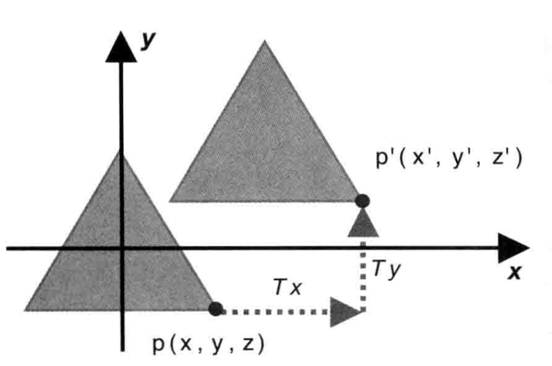
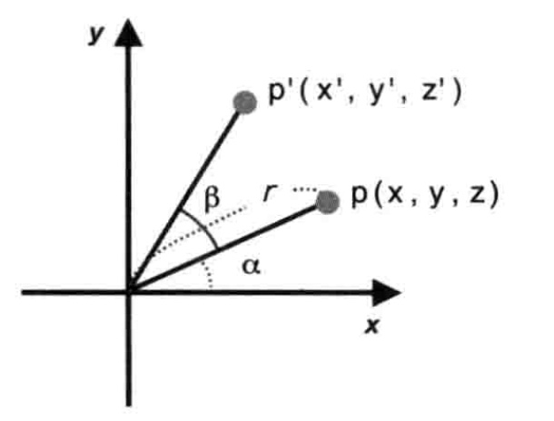
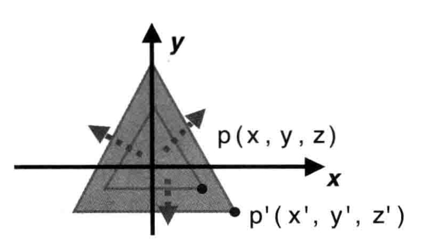

# 三角形的移动、旋转和缩放

在编写css的动画时，我们能够接触到`translate`，`rotate`，`scale`，现在我们来探究下这些动画背后的数学知识，以及如何把这些知识运用到webgl的图像变换上。

## 平移

当我们把点p(x, y ,z)移动到点p'(x', y', z')，那么点p在X轴，Y轴，Z轴的平移距离我们分别设为$T_x$，$T_y$，$T_z$。那么我们可以得到以下公式：  

$$
x'=x+T_x \\
y'=y+T_y \\
z'=z+T_z \\
$$

## 旋转

这里我们先用二维平面中的旋转来解释。假设r是从原点到点p的距离，而α是X轴旋转到点p的角度。根据这个条件，能得出式子1:  
$$
x=r cos\alpha\\
y=r sin\alpha
$$

现在p点的坐标是(x,y,z)，假设我们向上旋转了β角度，得到点p'(x',y',z')，那么我们能够得到式子2：  
$$
x' = rcos(\alpha+\beta)\\
y' = rsin(\alpha+\beta)\\
z' = z
$$

之后我们根据[三角函数两角和公式](https://baike.baidu.com/item/%E4%B8%A4%E8%A7%92%E5%92%8C%E5%85%AC%E5%BC%8F/10201637)，可推出式子3：  
$$
a = r (cos\alpha cos\beta - sin\alpha sin\beta)\\
b = r (sin\alpha cos\beta + cos\alpha sin\beta)
$$
然后我们把式子1代入式子3，得出式子4：  
$$
x' = xcos\beta - ysin\beta \\
y' = xsin\beta + ycos\beta \\
z' = z
$$

## 缩放

假设在三个方向X轴，Y轴，Z轴的缩放因子为$S_x$，$S_y$，$S_z$，那么有式子：  
$$
x' = S_xx\\
y' = S_yy\\
z' = S_zz
$$
## 变换矩阵
其实上面的这些变换公式，都能用统一的格式来表示，那就是矩阵。[矩阵乘法](https://baike.baidu.com/item/%E7%9F%A9%E9%98%B5%E4%B9%98%E6%B3%95/5446029)要求我们要用第一个矩阵的行去乘第二个矩阵的列，下面我们以平移的公式来推导出平移矩阵。
### 平移矩阵

在平移时，我们已经推出了以下公式：
$$
x'=x+T_x \\
y'=y+T_y \\
z'=z+T_z \\
$$
现在我们把它扩充成齐次坐标的形式。
$$
x' = ax + by + cz + d\\
y' = ex + fy + gz + h\\
z' = ix + jy + kz + l\\
1 = mx + ny + oz + p
$$
转成矩阵相乘的形式：
$$
\left[
	\begin{matrix}
	x'\\
	y'\\
	z'\\
	1
	\end{matrix}
\right] =
\left[
	\begin{matrix}
	a & b & c & d \\
	e & f & g & h \\
	i & j & k & l \\
	m & n & o & p
	\end{matrix}
\right] *
\left[
	\begin{matrix}
	x \\
	y \\
	z \\
	1
	\end{matrix}
\right]
$$
根据齐次坐标的定义，一个点（或者说一个矢量）有四个因子(x,y,z,w)。这里我们的w固定是1，在变换矩阵中最下一行永远是`[0,0,0,1]`，即上式中的m,n,o均为0，p为1。对比$x' = ax + by + cz + d$和$x'=x+T_x$，我们得出a,b,c均为0，d为$T_x$。经过最终的推导，我们得出平移矩阵为：
$$
\left[
\begin{matrix}
	1 & 0 & 0 & T_x \\
	0 & 1 & 0 & T_y \\
	0 & 0 & 1 & T_z \\
  0 & 0 & 0 & 1
\end{matrix}
\right]
$$

### 旋转矩阵
旋转矩阵和缩放矩阵的推导过程同理，不赘述。

$$
\left[
\begin{matrix}
	cos\beta & -sin\beta & 0 & 0\\
	sin\beta & cos\beta & 0 & 0 \\
	0 & 0 & 1 & 0 \\
  0 & 0 & 0 & 1
\end{matrix}
\right]
$$

### 缩放矩阵
$$
\left[
\begin{matrix}
	S_x & 0 & 0 & 0 \\
	0 & S_y & 0 & 0 \\
	0 & 0 & S_z & 0 \\
  0 & 0 & 0 & 1
\end{matrix}
\right]
$$

> 吐槽一下，在markdown里写公式是真的麻烦！

## 参考
* [Drawing and Transforming Triangles - WebGL Programming Guide](https://sites.google.com/site/webglbook/home/chapter-3)
* [旋转中的数学](https://zhuanlan.zhihu.com/p/382242423)
* [两角和公式](https://baike.baidu.com/item/%E4%B8%A4%E8%A7%92%E5%92%8C%E5%85%AC%E5%BC%8F/10201637)
* [矩阵乘法](https://baike.baidu.com/item/%E7%9F%A9%E9%98%B5%E4%B9%98%E6%B3%95/5446029)